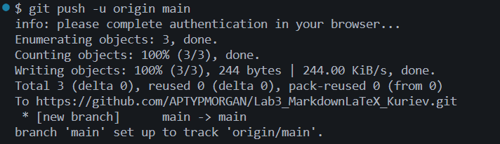
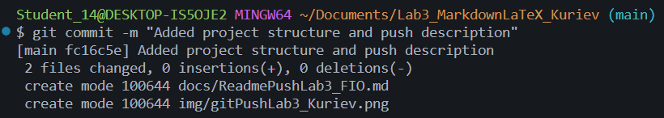

# Лабораторная работа №3 - Markdown и LaTeX

В данной лабораторной работе я изучаю основные возможности Markdown-разметки и использование LaTeX в документации.
В работе рассматриваются заголовки, списки, таблицы, ссылки, изображения, блоки кода и другие элементы Markdown.

---

## Содержание

1. [О проекте](#о-проекте)
2. [Структура проекта](#структура-проекта)
3. [Заголовки](#заголовки)
4. [Форматирование текста](#форматирование-текста)
5. [Списки](#списки)
6. [Цитаты](#цитаты)
7. [Блок кода](#блок-кода)
8. [Таблица](#таблица)
9. [Изображения](#изображения)
10. [Ссылки](#ссылки)
11. [Чекбоксы](#чекбоксы)
12. [Сноски](#сноски)
13. [Alert-блоки](#alert-блоки)
14. [LaTeX](#latex)

---

## О проекте

Главная цель этой лабораторной работы — научиться создавать и оформлять README-файлы с помощью Markdown.

Во время работы я изучил:

* основные элементы Markdown;
* работу со списками и таблицами;
* вставку изображений и ссылок;
* оформление блоков кода;
* использование GitHub Alert-блоков;
* создание математических формул с помощью LaTeX.

> README-файл нужен для того, чтобы понятно описать проект и показать основные возможности его использования.

---

## Структура проекта

Проект имеет следующую структуру:

* `README.md` - основной файл с описанием проекта;
* `docs/` - папка с Markdown-файлами лабораторной работы;

  * `headersLab3_Kuriev.md`
  * `separatorsLab3_Kuriev.md`
  * `formattingLab3_Kuriev.md`
  * `listsLab3_Kuriev.md`
  * `linksImagesLab3_Kuriev.md`
  * `codeQuotesLab3_Kuriev.md`
  * `tablesLab3_Kuriev.md`
  * `advancedMarkdownLab3_Kuriev.md`
  * `latexLab3_Kuriev.md`
* `img/` - папка со скриншотами;
* `latex/` - папка для примеров формул.

---

## Заголовки

В Markdown можно создавать заголовки разных уровней.

# Заголовок H1

## Заголовок H2

### Заголовок H3

Чем больше символов `#`, тем ниже уровень заголовка.

---

## Форматирование текста

В Markdown можно по-разному выделять текст.

**Полужирный текст**

*Курсивный текст*

~~Зачёркнутый текст~~

`Моноширный текст`

Также можно использовать ***жирный курсив***.

---

## Списки

### Маркированный список

* Первый пункт
* Второй пункт
* Третий пункт

### Нумерованный список

1. Первый пункт
2. Второй пункт
3. Третий пункт

### Вложенный список

1. Работа с Markdown

   * Заголовки
   * Списки
   * Таблицы
2. Работа с Git

   * `git add`
   * `git commit`
   * `git push`

---

## Цитаты

Цитата в Markdown создаётся с помощью символа `>`.

> Markdown позволяет удобно оформлять документацию.

Также можно сделать вложенную цитату:

> Первый уровень
>
> > Второй уровень

---

## Блок кода

В Markdown можно вставлять программный код.

Например, код на C#:

```csharp
Console.Write("Введите число: ");
double number = Convert.ToDouble(Console.ReadLine());

Console.WriteLine($"Вы ввели число: {number}");
```

Также можно использовать встроенный код:

Команда `git status` показывает состояние Git-репозитория.

---

## Таблица

В Markdown можно создавать таблицы.

| Функция              |  Команда Git |                      Описание |
| :------------------- | :----------: | ----------------------------: |
| Создание репозитория |  `git init`  |       Создаёт Git-репозиторий |
| Просмотр изменений   | `git status` |   Показывает состояние файлов |
| Добавление файлов    |  `git add .` |      Добавляет файлы в индекс |
| Создание коммита     | `git commit` |           Сохраняет изменения |
| Отправка на GitHub   |  `git push`  | Загружает изменения на GitHub |

---

## Изображения

В Markdown можно добавлять изображения из папки проекта.

Например:



Также можно добавить скриншот структуры проекта:



---

## Ссылки

### Внешние ссылки

[GitHub](https://github.com)

[Markdown Guide](https://www.markdownguide.org/ "Перейти на официальный сайт Markdown")

### Внутренняя ссылка

Можно перейти к разделу [LaTeX](#latex).

---

## Чекбоксы

Чекбоксы можно использовать для обозначения выполненных задач.

* [x] Создать README.md
* [x] Добавить заголовки
* [x] Добавить списки
* [x] Добавить таблицу
* [ ] Добавить новые примеры

---

## Сноски

Markdown используется для создания документации и README-файлов[^1].

Также с помощью сносок можно добавлять дополнительные пояснения[^2].

[^1]: README-файл обычно используется для описания проекта.

[^2]: Сноска содержит дополнительную информацию, которая не помещается в основной текст.

---

## Alert-блоки

GitHub поддерживает специальные Alert-блоки.

> [!NOTE]
> Это простая заметка о проекте.

> [!TIP]
> Полезный совет: перед отправкой изменений на GitHub можно проверить их с помощью `git status`.

> [!WARNING]
> Перед выполнением команд Git нужно убедиться, что вы находитесь в правильной папке проекта.

---

## LaTeX

LaTeX можно использовать для записи математических формул.

### Inline LaTeX

Формула может находиться прямо внутри текста.

Например, площадь круга вычисляется по формуле $S = \pi r^2$.

Также можно записать степень $x^2$ и индекс $a_i$.

### Block LaTeX

Более большие формулы можно записывать отдельным блоком:

$$
\sum_{i=1}^n i = \frac{n(n+1)}{2}
$$

Пример дроби:

$$
\frac{a}{b}
$$

Пример корня:

$$
\sqrt{x}
$$

Пример матрицы:

$$
\begin{pmatrix}
1 & 2 \\
3 & 4
\end{pmatrix}
$$

Пример с греческими буквами:

$$
\alpha + \beta = \gamma
$$